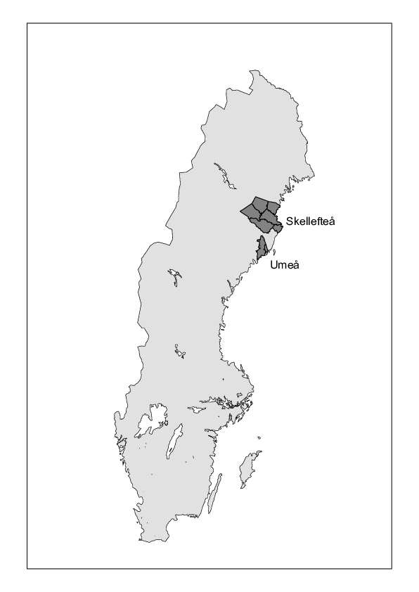

```{r setup, include=FALSE}
library(knitr)
opts_chunk$set(engine='R',fig.path='figs/art3d-',tidy=FALSE,fig.height=8.5,fig.width=8,strip.white=TRUE,cache=FALSE,echo=FALSE,message=FALSE,comment=NA,show.signif.stars = FALSE,warnings = FALSE)##$
library(knitr)
library(eha)
library(xtable)
library(skum)
source("R/oneSpell.R")
options(show.signif.stars = FALSE)
```

```{r readalldata}
source("R/get.file.R")
skume <- get.file("skume")
##load("data/skume.rda")
skume <- skume[order(skume$id, skume$enter), ]
skume$id <- paste("pop", skume$id, sep = "_")
##
skume1 <- age.window(skume, c(40, 65))  ###### OJOJOJ!!!!!!!!!!!!!!!!!!!!!!!!!!! (40, 65)
skume1 <- oneSpell(skume1)
##
skume2 <- age.window(skume, c(65, 100))
skume2 <- oneSpell(skume2)
##################################################
foli <- get.file("foli")
##load("data/foli.rda")
foli$civst[is.na(foli$civst)] <- "unmarried"
foli <- foli[order(foli$id, foli$enter), ]
foli$AR <- foli$ULORSAK <- NULL
##
foli1 <- age.window(foli, c(40, 65))
foli1 <- oneSpell(foli1)
##
foli2 <- age.window(foli, c(65, 100))
foli2 <- oneSpell(foli2)
##################################################
source("CreData/R/addPer.R")
skume1 <- addPer(skume1, cuts = seq(1801, 1951, by = 25))
skume2 <- addPer(skume2, cuts = seq(1801, 1951, by = 25))
##
foli1 <- addPer(foli1, cuts = c(1976, 1986, 1996, 2005, 2014))
foli2 <- addPer(foli2, cuts = c(1976, 1986, 1996, 2005, 2014))
##################################################
vb1 <- rbind(skume1, foli1)
vb1$period <- factor(vb1$period)
##
vb2 <- rbind(skume2, foli2)
vb2$period <- factor(vb2$period)
vb <- rbind(vb1, vb2)
vb$exposure <- vb$exit - vb$enter # For statistics and figures purposes
```

# Introduction


A major theme in demographic and epidemiological studies is the seemingly persistent effect of social class on mortality. In the present study, we challenge common notions of this by taking a long-term perspective on the development of social class inequalities in mortality in the adult and elderly population with a special focus on the relative differences. The arguments for our statements are based on an investigation of the Skellefteå and Umeå regions in northern Sweden for the periods 1801--2013 for Skellefteå and 1901--2013 for Umeå. The main issue is analysed according to gender and age group (working age vs retired), testing whether the same patterns prevail in old age---the retired population---as in working age.  Furthermore we place this in the context of how the inequality in mortality is associated with the development of economic inequality in society. The results are discussed in relation to the mortality transition and the social determinants of health and mortality, as well as their implications on some of the most influential hypotheses and concepts in health research.

Based on the results, we argue that high social class is not necessarily favourable for survival. Social conditions and social position certainly have impact, but not always in the expected direction. In our case this is apparent for men during a large part of the studied period; only at a surprisingly late date appears a male mortality class reversal, changing the relation to a substantial advantage of being in a higher social position. Mortality risks in different contexts must be understood in the intersection between class and gender. We suggest that health-related behaviour is not only important in present-day societies, but was also decisive in earlier phases of the mortality transition. The results implicate that the association between social class and health is more complex than is assumed in many of the dominant theories in demography and epidemiology.


## Social class and mortality

One of the central aspects of survival is social class and access to economic
and other resources. In present-day welfare societies, social position, either according to social class, education or income, is a
strong determinant when it comes to health and mortality and its impact even
are increasing [@kuetal04; @macketal16; @frlu07; @broba12; @strand10]. @liph02 suggest that
"... social conditions have been, are and will continue to be irreducible
determinants of health outcomes and therefore deserve their appellation of
'fundamental causes' of disease and death". The persistence of social inequality in mortality to the disadvantage of the lower classes is one of the main assumptions in their theory [@liph95; @liph98]. The reigning view is that socio-economic health and mortality inequalities were large in historical societies, probably larger than in modern societies. This is a
reasonable assumption since these societies were often characterized by
enormous class differences. Knowing that access to different kinds of resources, such as economic, social and cultural capital, provides advantages in all aspects of life, the health advantage of higher classes ought to be obvious. 

However, recent studies investigating social inequality in health and mortality
with micro-data have questioned the generality of the assumed
pattern [@bevp11]. Solid empirical evidence about the process is lacking however and studies
focusing on the issue are still few. There is a need for additional reliable
studies from different geographical and historical settings in order to 
better understand the role of class and socio-economic conditions in health and survival over time. 


Social position affects health and mortality differently during the life course. There are different hypotheses about the impact in adulthood and old age respectively. The differences either converge in old age (status levelling), are constant (status maintenance), or diverge (cumulative advantage) [@hof08]. Diminishing differences may be a consequence of the circumstance that biological factors become increasingly important during the ageing process and in old age, leaving less impact for social factors. The status maintenance hypothesis basically assumes 
continuity in the determinants of social health inequalities from adulthood to old age.
The cumulative (dis)advantage hypothesis [@dan03], implies that advantages and disadvantages persist and accumulate during life in a negative spiral rewarding some while disfavouring others. This leads to larger differences in old age. 


Another aspect of the development of social inequality in mortality concerns its relation to economic inequality. @wipi09 argue that income inequality has an independent effect on mortality, separate from the direct effect of actual access to economic resources. They find
that unequal societies (basically countries) perform less well when it comes to health (as well as other social conditions) than equal ones in the todays economically developed world. This has initiated a vital scholarly debate and the topic has been extensively studied [@suka04; @wado00]. In recent decades, the respective association between trends of inequalities in mortality and income is weak or non-existent according to @hoetal16. What the association looked like in previous periods is unknown;  this is of particular interest as the levels of economic inequality differed fundamentally from those of recent decades. Even if not a necessary implication, it is reasonable to assume that poorer groups were the most disadvantaged due to large levels of inequality. 

When it comes to Sweden both income and wealth distributions were strongly skewed from the 1870s to the early 20th century. Starting during the inter-war period, income and
wealth inequality continuously diminished to reach a low point at around
1980. Since then, economic inequality has increased substantially until the
present, although it is far from as high as it was a century ago [@rowa08; @rowa09]. 
The Swedish development resembles that of other European and North
American countries in its basic features [@rowa14].


# The Skellefteå and Umeå regions

(ref:cities) The Skellefteå and Umeå regions in Sweden.

```{r mapp,fig.cap = "(ref:cities)", fig.height=6,fig.align='center', out.height="5in"}

```
During the studied period, Sweden developed from a poor agricultural society with low urbanization to a rich welfare state. If Sweden is peripheral from a European continental perspective, the regions studied here are remote from the central parts of the country. The Skellefteå and Umeå regions (Figure \@ref(fig:mapp)) are part of the county of Västerbotten in northern of Sweden along the coast of the Gulf
of Bothnia, where communication with
the rest of Sweden was difficult until the late 19th century. The economy
was dominated by agriculture, making it vulnerable to harvest failures; several severe famines occurred in the regions during the 1800s, for example after the harvest failure of 1867 [@segb14]. During the long winters, sea communication was hindered due to the Gulf of Bothnia being frozen. The first ships of the year came to this area in May or even as late as June in some cases [@fah56]. Towards the end of the 19th century, the Swedish railway system reached this part of Sweden, facilitating contact with the rest of Sweden and, improving the economy and making it possible to mitigate the effects of harvest failures. During the 19th century, our regions became increasingly integrated in the same epidemiological pattern as the rest of Sweden.

In our dataset, before 1950 the Skellefteå region consists of a selection of parishes surrounding the town of Skellefteå, founded in 1845 but with a very small population during the 19th century. The data from the period after 1975 cover the Skellefteå, Norsjö and Malå municipalities, the same area as
for the earlier period but with the addition of two more parishes. The
majority of the 19th century population lived in rural villages and
hamlets, making its livelihood from agricultural production. During the
20th century, industrialization took place. This also led to a population increase both in both the town
and the rural parts, resulting in a more diversified economy.

Mortality was fairly low compared with other parts of the country and
the fertility transition was late [@coa86]. The Skellefteå population
size as defined in our data sets (all ages) was 6,142 on January 1, 1801, 43,212 on January 1, 1901, and 76,723 at the end of the 20th century.

The Umeå region in the dataset consists of Umeå urban and rural parishes 1901--1950, and from 1976 onwards of Umeå municipality, withn another three parishes included. This region has a somewhat different character to that of Skellefteå. Umeå town had for a long time a small population, although substantially, and was the administrative, educational and military centre of the county of Västerbotten. During the latter part of the 20th century, the establishment of Umeå University led to a rapid population increase. Agriculture dominated the rural part, but there were also some foundries as well as forestry industries. Consequently the economy was more diversified than that of Skellefteå. The population size as defined in our data sets (all ages) was 19,138 on January 1, 1901 and 103,970 when the 20th century ended.


# Data and variables

The recent extension in time of data at the Demographic Data Base (DDB),
Umeå University (http://www.cedar.umu.se) by including the period 1900 to
1950 makes it possible to investigate the long-term development of social
inequality in mortality in this part of Sweden. The data for the present study come from two large
population databases at the DDB, which provide us with micro-data for the Skellefteå and Umeå regions in northern Sweden. Our data set constitutes a large population with substantial social diversity that can be followed for a uniquely long time. The period 1801--1950 is covered by the database Poplink [@wee16]. Poplink is based on linked parish records, allowing us to reconstruct life biographies on people as long as they remained in the region. The records are linked within, but not
between, the regions. 

The other large data set is extracted from the Linnaeus database
[@malm10], which is based on different linked national population
registers from 1960 to 2013 (censuses, LISA from Statistics Sweden and cause of death registers) and is used within the ageing programme at CEDAR, Umeå
University. Due to data issues (a great deal of missing data in some variables, for example social class, and additional work required to define the exact geographical areas of analysis) we choose to use Linnaeus data from 1976 onwards. The study period from 1976 to 2000 is constructed from
censuses every fifth year during the period 1975--1990, with additional information on deaths
from the National Board of Health and Welfare. For the period 2002--2013 we use
the information from the yearly population registers from Statistics Sweden
(LISA) together with information on mortality from the National Board of Health and
Welfare.

Individuals are anonymized and as the two databases are not
linked they are treated as separate units. This prevents us from following individuals between the two databases throughout their lives. It also makes it impossible to add information on individuals in the Linnaeus database from what we could potentially extract from Poplink, for example family
background or previous social class.


```{r lexis2,fig.cap="The sampling frame.", fig.height = 5}
plot(c(1801, 1801, 1951, 1951, 1801), c(30, 100, 100, 30, 30),
     type = "l", xlim = c(1800, 2014), lwd = 2, col = "red",
     xlab = "Year", ylab = "Age", axes = FALSE, ylim = c(0, 100))
axis(1, at = c(1801, 1851, 1901, 1951, 1976, 1986, 1996, 2005, 2014), las = 2)
axis(2, las = 2, at = c(0, 30, 65, 100))
axis(4, las = 2, at = c(0, 30, 65, 100))
box()
abline(h = 0)
lines(c(1976, 1976, 2014, 2014, 1976), c(30, 100, 100, 30, 30),
      col = "blue", lwd = 2)
#
pn.exp <- round(sum(skume1$exit - skume1$enter) + sum(skume2$exit - skume2$enter))
pn.d <-  as.integer(sum(skume1$event) + sum(skume2$event))
#
text(1875, 70, "PopLink", cex = 2, col = "red")
##text(1899, 60, paste(pn.rec, "records"))
text(1875, 55, paste(round(pn.exp / 1000000, 1), "million p-years"))
text(1874.5, 50, paste(round(pn.d / 1000, 1), "thousand deaths"))
#
n.exp <- round(sum(foli1$exit - foli1$enter) + sum(foli2$exit -foli2$enter))
n.d <-  as.integer(sum(foli1$event) + sum(foli2$event))

text(1995, 70, "Linnaeus", cex = 1.5, col = "blue")
##text(1984, 60, paste(n.rec, "records"))
text(1995.2, 55, paste(round(n.exp / 1000000, 1), "million p-years"), cex = 0.8)
text(1995.2, 50, paste(round(n.d / 1000, 1), "thousand deaths"), cex = 0.7)
```

In the data set analysed here, all individuals aged 30 years and older ever
having resided in either of the regions are included. The data file
contains the variables social class, gender, urban/rural
residence, birth date, death date, first and last date of observation and
type of entrance/exit. The total number of person years is `r round(pn.exp / 1000000, 2)` millions leading to
`r round(pn.d /1000, 2)` thousand deaths in Poplink and `r round(n.exp / 1000000, 2)` million person years leading 
to `r round(n.d / 1000, 2)` thousand deaths in the Linnaeus database: see 
Figure \@ref(fig:lexis2).

## Presence periods

Differences in available information in the two datasets as well as in
the Linnaeus data make it necessary to apply different approaches when it
comes to the identification of presence periods. The Poplink data provide us with exact dates, or at least year of start and exit of presence, allowing us
to have full and continuous control over the \emph{de jure} population. This is
not the case with the Linnaeus database, however. For the period 1976--2001
we use presence in the censuses 1975--1990 and information on deaths from the National
Board of Health and Welfare. The populations in the Skellefteå and Umeå regions are those residing there according to the censuses. Each census constitute the baseline for which persons are followed up during the five years until the next census (e.g. the 1975 census has a follow-up from 1 January 1976 until the end of 1980). The exception of this is the 1990 census for which the follow-up is until 2001. Thus, the deaths do not necessarily take place in our region for the Linnaeus analyses, although this is usually the case. 

For the last period, 2002--2013, we use the yearly population registers
(LISA data) together with information on deaths from the National Board of
Health and Welfare. This allows for full control over the presence periods
in the studied regions.


## Social class


Mortality differences are analysed according to social class, based on a modified form 
of the classification scheme Hisclass [@lema11]. The only, and obvious, alternative for conducting a longitudinal study of socio-economic mortality differences with consistent classification
schemes in the two databases is occupations. Thus, analysing according to social class, apart from
being a scientific choice, is also a practical one. Social position is treated as a time-dependent variable during working age but defined from the last occupation in working age for the elderly and retired population; i.e. from age 65 until death or last observation.

The availability of information on occupations varies over time and between
sources. In Poplink, occupations are coded according to the original DDB coding system that has then been adapted to Hisclass. For the Linnaeus data, the occupations are available in the coding scheme HISCO [@lema02] who then are recoded into Hisclass. We consider the observed social class in a census to be valid for the full period until the next census, corresponding to our definition of presence periods. For the period 1991--2000 the social class in the 1990 census is considered to be maintained until 2001. 


The two different data sets represent different ways of reporting occupations. Poplink usually only provides the occupation of the head of household, thus underestimating female labour force participation as well as that of adult children residing with their parents [@vik10]. For the Poplink period, we have chosen to categorize wives according to the position of the head of household, usually
the husband/father, assuming that the family shares the same socio-economic
position. We consider this as a reasonable approach for this period. 

Female labour is much better covered in the Linnaeus database, and it is difficult to define households in the same way as in Poplink. Extramarital cohabitation became common and female
labour force participation developed as the norm, in Sweden during this
period. The husband's occupation, as signifier of social class became,
if not obsolete, at least less relevant. All included persons are signified
by their individual occupation for this period. Although the results for the different periods are not completely comparable, the difference in approach reflects an actual change in how social class is structured.

Hisclass, the classification system used as a basis for our categorization, is a "...
HISCO-based historical international social class scheme" [@lema11; @lema02]. 
The different classes in Hisclass represent distinct
categories, based on whether the work is manual or non–manual, skill level,
supervision, and sector. Implicitly it reflects large differences in access to
economic resources, status, social power, etc.  We have chosen to work with a broad definition of classes, merging the original 12 social classes in Hisclass into four, representing different levels of control and access to resources vital for life chances, and an additional fifth category of unknown class:

\begin{enumerate}
\item {\tt elite}, Hisclass 1 and 2. Higher managers and higher professionals.
\item {\tt middle}, Hisclass 3, 4, 5, and 6. Lower managers,
farm hands and lower professionals, clerical and sales personell.
\item {\tt worker}, Hisclass 7, 9, 10, 11 and 12. Workers including
farm workers.
\item {\tt farmer}, Hisclass 8. Farmers. 
\item {\tt none}, not given, unknown. 
\end{enumerate}


Figures \@ref(fig:hiscskumm) and \@ref(fig:hiscskumw) show the distribution
(per cent) of exposure time according to class for men and women,
respectively. The farmer category was dominant until the middle of the 20th centuries but have become marginal in the latest periods, particularly among women. The category of workers is fairly stable over time. The highest class has increased substantially, albeit from a very low level
in the 19th century. The increase in academics in connection to the
establishment of Umeå University explains much of this increase in later time. Furthermore, 
we observe a rather high percentage of missing social class in the early 19th century. 
For men the proportion is somewhat higher in the age group 65 and above, those who were retired, 
but still low enough to be used in our analyses (results not shown). If we disregard the very first period, 
however, there were very few with occupation missing until 1950. 

```{r hiscskumm, fig.cap = "Exposure by social class (from the top: elite, middle, workers, farmers, none) and time period, men.", fig.scap="Exposure by social class and time period, men.", out.height = "14cm", fig.height=4}
xx <- with(vb[vb$sex == "male", ], tapply(exposure, list(period = period, hisclass = hisclass), sum))
##xy <- with(skume[skume$sex == "male", ], tapply(exposure, list(period = period, hisclass = hisclass), sum))
##xz <- with(foli[foli$sex == "male", ], tapply(exposure, list(period = period, hisclass = hisclass), sum))
##xxx <- rbind(xx, xy, xz)
yy <- round(prop.table(xx, 1) * 100, 1)
barplot(t(yy)[5:1, ], col = c("red", "darkgreen", "blue", "green", "black"), las = 2, ylab = "Per cent")
```

```{r hiscskumw, fig.cap = "Exposure by social class (from the top: elite, middle, workers, missing) and time period, women.", out.height = "14cm", fig.scap="Exposure by social class and time period, women.",fig.height=4}
xx <- with(vb[vb$sex == "female", ], tapply(exposure, list(period = period, hisclass = hisclass), sum))
##xy <- with(skume[skume$sex == "female", ], tapply(exposure, list(period = period, hisclass = hisclass), sum))
##xz <- with(foli[foli$sex == "female", ], tapply(exposure, list(period = period, hisclass = hisclass), sum))
##xxx <- rbind(xx, xy, xz)
yy <- round(prop.table(xx, 1) * 100, 1)
barplot(t(yy)[5:1, ], col = c("red", "darkgreen", "blue", "green", "black"), las = 2, ylab = "Per cent")
```


The proportion with missing values among women is a larger problem, however;
see Figure \@ref(fig:hiscskumw). Corresponding to what we found for men, the
proportion without social position is very low until the middle of the 20th
century, reflecting the way women's social position is defined. However, the frequency of missing social class is quite high during particularly the first two periods of data from the Linnaeus database---from 1976. Since female social class for this period is defined
according to own occupation, the consequence of many women being outside
the workforce is that the proportion of missing increases. For the later periods,
the results are fairly complete.

## Marital status

Marital status (see Figure \@ref(fig:civstskum)) is a time-fixed covariate.
The statuses used are unmarried, married and dissolved marriage
(without distinguishing between widowed and divorced). If no explicit
status is given in the sources and the partner is missing, the status has been
set to unmarried. Note that it has not been possible to identify cohabitation.


```{r civstskum, fig.cap = "Exposure by marital status (from the top: never married, married and previously married) and time period", fig.scap='Exposure by marital status and time period.',out.height = "14cm",fig.height=4}
xx <- with(vb, tapply(exposure, list(period = period, civst = civst), sum))
##xy <- with(skume, tapply(exposure, list(period = period, civst = civst), sum))
##xz <- with(foli, tapply(exposure, list(period = period, civst = civst), sum))
##xxx <- rbind(xx, xy, xz)
yy <- round(prop.table(xx, 1) * 100, 1)
barplot(t(yy)[3:1, ], col = c("red", "blue", "green"), las = 2, ylab = "Per cent")
```


## Urban vs rural residence

In 19th and early 20th century Sweden (as in other countries), mortality
was much higher in urban environments [@hani94; @edv92]. The unsanitary and overcrowded
living conditions, as well as the risk of importing infections, made the
health risks higher in towns and cities. In the present paper, the variable **urban** (values *TRUE* or *FALSE*) controls
for this aspect by distinguishing between urban and rural residence for the periods after 1900, based on parish or place of residence.

## Periods of analysis

We have done separate analyses for the different time periods. The period
1801--1950 is divided into six subperiods of 25 years each. The 19th century
periods represent a mainly pre-industrial society dominated by agriculture
and with only basic welfare provisions. During the years 1901--1950,
industrialization started and the urban environments increased in
population size. The modern Swedish welfare state began to develop. For the 
period 1976 onwards, there are separate analyses of five- or six-year periods. Sweden had developed into a wealthy welfare society with low income inequality. Then in the early 1990s, a financial crisis struck Sweden, which among other things increased unemployment and changed parts of
the welfare system towards being less generous. The start of the
last period (2008--2013) coincides with the international financial
crisis. In the most recent decades income inequality has increased considerably.


# Model

The comparison of mortality in the five social classes, period by period, is done
by comparing estimated survival curves, adjusted for the distribution of the confounding variables over the social classes.
The adjustment carried out by inverse probability weighting (**reference**) in the following way: First, for each social class, 
the probability that an individual in the class belongs to that class is estimated by logistic regression with the 
confounders as explanatory variables. Second, these probabilities are inverted and used as weights in the estimation of the survival 
curves for each social class.   


<!--
## The conditional model

The parametric model we use for the baseline hazard function is piecewise
constant at five-year intervals, so we arrive at the following proportional
hazards regression model:

\begin{equation}\label{eq:prop}
h(t; \lambda, \boldsymbol{\beta}, \textbf{x}) =
\lambda(t)e^{\boldsymbol{\beta} \mathbf{x}}, \; \; 30 < t \le 100,
\end{equation}
where

\begin{equation*}
\begin{split}
\mathbf{x} &= (x_1, \ldots, x_n) \text{ is a vector of covariates,} \\
\boldsymbol{\beta} &= (\beta_1, \ldots, \beta_n) \text{ is the corresponding vector of regression
parameters.} \\
\end{split}
\end{equation*}
and
\begin{equation*}
\lambda(t) = \alpha_i,\; 30 + 5(i - 1) < t \le 30 + 5i, \; i = 1, \ldots, 10.
\end{equation*}

Since all components of $\mathbf{x}$ are categorical covariates, the
estimation of the model can be performed in two ways; based on the
original data set and a survival analysis routine handling a piecewise
constant hazard;  or based on the reduced data set (table) and
\emph{Poisson regression}. The second way is faster than the first by a
size factor of at least 100, often much more, and
the point is that the two ways give exactly the same results. This is
because the table is a \emph{sufficient statistic} for the model and
the original data set.


The analyses are performed in the **R** environment for statistical computing
and graphics [@cran], especially using the package **eha**
[@gb12;@eha]. In the analysis, data are divided into two age groups,
30--64 and 65--99 years of age. The model controls for marital status and whether the individual resides in the urban or rural parts of the regions. Each period is analysed separately, 
but we then combine results in order to show the development of the social patterning of mortality during the studied period.

The important explanatory variable, social class, is included in the
proportional hazards models as a *stratification* variable. The main
reason for this choice is that the effect of social class on survival is
non-proportional; that is, it varies with age. With the reduced data set
and Poisson regression, this is simply achieved by introducing an
interaction term between **age** and social class. Then, the main
results are presented graphically.  The comments on the results are based on
the figures and focus on the central variable in our study, social class. 

The models are fitted separately for sex and each period, from  1801 to
2013. We stratify on social class and include the covariates **urban** (TRUE or FALSE) and
**civst** (marital status). The *cumulative hazards* at the end of the age period *30--64* 
conditional on survival to age 30,  and  *remaining expected life at 65* are the
main targets in our analysis. These numbers are used in the process of
graphically illustrating the development over time.

-->

The disturbace effect of confounders is 
balanced out through weighting. In our case , `civil status` and `urban/rural` are confounders, that is, they 
are correlated to both our outcome, mortality, and our explanatory variable, social class. The latter association 
manifests itself through the facts that the marriage frequency varies by social class and certain social classes are 
more common in the rural area than others (we find farmers on the countryside).

```{r colorc}
## Colors for plotting strata:
scol <- c("black", "green", "blue", "darkgreen", "red")
## Common for all groups:

labb <- levels(vb$period)
nper <- length(labb)
#source("R/getPHglm.R")
## End 'common'
```

## Association between civil status and social class over time

In order to simplify the illustration, we look at `civil status` in two groups, `ever married` and `unmarried`, in Figure \@ref(fig:assesciv).

```{r assesciv, fig.cap = "Fraction ever married by hisclass and period.", fig.height = 4}
orr <- aggregate(x = vb$exposure, by = vb[, c("period", "civst", "hisclass")], FUN = sum)

levper <- levels(orr$period)
nper <- length(levper)
levhis <- levels(orr$hisclass)
nhis <- length(levhis)
out <- matrix(0, nrow = nhis, ncol = nper)
for (per in 1:nper){
    for (his in 1:nhis){
        oo <- orr[orr$period == levper[per] & orr$hisclass == levhis[his], ]
        nam <- sum(oo$x)
        out[his, per] <- sum(oo$x[oo$civst != "unmarried"]) / nam
    }
}
out <- 100 * out
xli <-  c(1812, 1837, 1862, 1887, 1912, 1932, 1981, 1991, 2000, 2009)
plot(xli, out[1, ], type = "b", xlab = "", ylab = "Fraction ever married", 
     axes = FALSE, col = scol[1], lty = 1, pch = 1, ylim = c(0,100))
axis(1, at = xli, labels = levper, las = 2, cex = 0.7)
axis(2, las = 1)
box()
abline(h = 0)
for (r in 2:nhis){
    lines(xli, out[r, ], col = scol[r], lty = r, pch = r, type = "b")
}
legend("bottomright", legend = levhis, lty = 1:5, col = scol, pch = 1:5)
```

## Association between urban/rural and social class over time

```{r assesurb, fig.cap = "Fraction urban by hisclass and period.", fig.height = 4}
orr <- aggregate(x = vb$exposure, by = vb[, c("period", "urban", "hisclass")], FUN = sum)

levper <- levels(orr$period)
nper <- length(levper)
levhis <- levels(orr$hisclass)
nhis <- length(levhis)
out <- matrix(0, nrow = nhis, ncol = nper)
for (per in 1:nper){
    for (his in 1:nhis){
        oo <- orr[orr$period == levper[per] & orr$hisclass == levhis[his], ]
        nam <- sum(oo$x)
        out[his, per] <- sum(oo$x[oo$urban == TRUE]) / nam
    }
}
out <- 100 * out
xli <-  c(1812, 1837, 1862, 1887, 1912, 1932, 1981, 1991, 2000, 2009)
plot(xli, out[1, ], type = "b", xlab = "", ylab = "Fraction urban", 
     axes = FALSE, col = scol[1], lty = 1, pch = 1, ylim = c(0,100))
axis(1, at = xli, labels = levper, las = 2, cex = 0.7)
axis(2, las = 1)
box()
abline(h = 0)
for (r in 2:nhis){
    lines(xli, out[r, ], col = scol[r], lty = r, pch = r, type = "b")
}
legend("bottomleft", legend = levhis, lty = 1:5, col = scol, pch = 1:5, cex = 0.8)
```

## Inverse probability weighting

In order to eliminate the disturbing effect on the association between hisclass and mortality by
the confounders civil status and urban/rural, weights that eliminates the associations between hisclass 
and the confounders are introduced. This is done period by period. 

As an illustration, take the period `2005-2013` with males, 65--99 years of age. 

```{r exweight,echo=TRUE,echo = FALSE}
vb2_2005_men <- vb2[vb2$sex == "male" & vb2$period == "2005-2013", ]
fit1 <- glm(I(hisclass == "elite") ~ urban * civst, data = vb2_2005_men, family = binomial)
fit2 <- glm(I(hisclass == "middle") ~ urban * civst, data = vb2_2005_men, family = binomial)
fit3 <- glm(I(hisclass == "worker") ~ urban * civst, data = vb2_2005_men, family = binomial)
fit4 <- glm(I(hisclass == "farmer") ~ urban * civst, data = vb2_2005_men, family = binomial)
fit5 <- glm(I(hisclass == "none") ~ urban * civst, data = vb2_2005_men, family = binomial)
wght <- numeric(NROW(vb2_2005_men))
##
gg <- vb2_2005_men$hisclass == "elite"
wght[gg] <- 1 / predict(fit1, type = "response")[gg]
##
gg <- vb2_2005_men$hisclass == "middle"
wght[gg] <- 1 / predict(fit2, type = "response")[gg]
##
gg <- vb2_2005_men$hisclass == "worker"
wght[gg] <- 1 / predict(fit3, type = "response")[gg]
##
gg <- vb2_2005_men$hisclass == "farmer"
wght[gg] <- 1 / predict(fit4, type = "response")[gg]
##
gg <- vb2_2005_men$hisclass == "none"
wght[gg] <- 1 / predict(fit5, type = "response")[gg]
##
vb2_2005_men$wght <- wght
```


Let us fit with and without weights, see Figure \@ref(fig:testfit).

```{r testfit, fig.cap = "Survival by hisclass, men 2005-2013, unweighted and weighted analysis.", fig.height = 4}
par(cex.axis = 0.8)
fit <- coxph(Surv(enter, exit, event) ~ strata(hisclass), data = vb2_2005_men)
med <- summary(survfit(fit))$table[, "median"]
fitw <- coxph(Surv(enter, exit, event) ~ strata(hisclass), weights = wght, data = vb2_2005_men)
medw <- summary(survfit(fitw))$table[, "median"]
oldpar <- par(mfrow = c(1, 2))
plot(survfit(fit), mark.time = FALSE, col = scol, lty = 1:5, xlim = c(65, 100), 
     xlab = "Age", ylab = "Survival", main = "Unweighted", axes = FALSE)
tics <- c(65, round(med["none"], 1), round(med["elite"], 1), 100)
axis(1, at = tics, las = 1, cex.axis = 0.8)
axis(2, at = c(0, 0.5, 1), las = 1)
box()
abline(h = 0)
abline(h = 0.5, lty = 3)

lines(c(med["none"], med["none"]), c(0, 0.5), col = "red", lty = 3)
lines(c(med["elite"], med["elite"]), c(0, 0.5), col = "black", lty = 3)
legend("bottomleft", legend = levels(vb2$hisclass), col = scol, lty = 1:5, cex = 0.8)
plot(survfit(fitw), mark.time = FALSE, col = scol, lty = 1:5, xlim = c(65, 100), 
     xlab = "Age", ylab = "Survival", main = "Weighted", axes = FALSE)
tics <- c(65, round(medw["none"], 1), round(medw["elite"], 1), 100)
axis(1, at = tics, las = 1, cex.axis = 0.8)
axis(2, at = c(0, 0.5, 1), las = 1)
box()
abline(h = 0)
abline(h = 0.5, lty = 3)

lines(c(medw["none"], medw["none"]), c(0, 0.5), col = "red", lty = 3)
lines(c(medw["elite"], medw["elite"]), c(0, 0.5), col = "black", lty = 3)
legend("bottomleft", legend = levels(vb2$hisclass), col = scol, lty = 1:5, cex = 0.8)
medi <- cbind(med, medw)
colnames(medi) <- c("Unweighted", "weighted")
##
```

The social class differences are smaller in the weighted analysis, meaning that some of the raw differences are due to different distributions of the confounders  between the social classes.

For simple comparison over time, we need  simple summary measures, for instance the medians, shown in Figure \@ref(fig:testfit) and Table \@ref(tab:estmed).


```{r estmed}
knitr::kable(round(medi, 1), caption = "Estimated medians, men 65-99, 2005-2013.")
```

However, for the age interval 40--64 the median is not a good measure, because the probability to survive age 65, given survival to age 40, is much larger than 0.5, see Figure \@ref(fig:forty64). 

```{r forty64, fig.cap = "Adjusted survival curves, men in ages 40-65 and 65-100, years 2005-2013.", fig.height = 4}
source("R/getWeights.R")
da <- vb1[vb1$sex == "male" & vb1$period == "2005-2013", ]
da$wght <- getWeights(da)
##
fit0 <- coxph(Surv(enter, exit, event) ~ strata(hisclass), data = da)
med0 <- summary(survfit(fit))$table[, "median"]
fitw0 <- coxph(Surv(enter, exit, event) ~ strata(hisclass), weights = wght, data = da)
medw0 <- summary(survfit(fitw))$table[, "median"]
oldpar <- par(mfrow = c(1, 2))
plot(survfit(fitw0), mark.time = FALSE, col = scol, lty = 1:5, xlim = c(40, 65), 
     xlab = "Age", ylab = "Survival", main = "40-65", axes = FALSE)
tics <- c(40, 45, 50, 55, 60, 65)
axis(1, at = tics)
axis(2, at = c(0, 0.5, 1), las = 1)
box()
abline(h = 0)
abline(h = 0.5, lty = 3)
legend("bottomleft", legend = levels(vb2$hisclass), col = scol, lty = 1:5, cex = 0.7)
##lines(c(med["none"], med["none"]), c(0, 0.5), col = "red", lty = 3)
##lines(c(med["elite"], med["elite"]), c(0, 0.5), col = "black", lty = 3)
plot(survfit(fitw), mark.time = FALSE, col = scol, lty = 1:5, xlim = c(65, 100), 
     xlab = "Age", ylab = "Survival", main = "65-100", axes = FALSE)
tics <- c(65, 70, 75, 80, 85, 90, 95, 100)
axis(1, at = tics)
axis(2, at = c(0, 0.5, 1), las = 1)
box()
abline(h = 0)
abline(h = 0.5, lty = 3)
legend("bottomleft", legend = levels(vb2$hisclass), col = scol, lty = 1:5, cex = 0.7)
```

We cannot use the "median remaining life" as a summary comparison measure here, for obvious reasons. Instead, the *area under the survival curves* will be used. This area can be interpreted as the *expected years of life before 65(100)* for a person aged 40(65). Here we get

```{r explife40}
avew <- round(summary(survfit(fitw), rmean = 100)$table[, "*rmean"], 2)
avew0 <- round(summary(survfit(fitw0), rmean = 65)$table[, "*rmean"], 2)
aver <- cbind(avew0, avew)
colnames(aver) <- c("Men, 40-64", "Men, 65-99")
knitr::kable(round(aver, 1), caption = "Expected years of life before 65(100) for a 40(65) year old man, by social class." )
```

This is now repeated for each period, and for men and women separately.


```{r inipw, eval = FALSE}
source("R/ipw.R")
vb1Tab <- aggregate(vb0Tab[c("event", "exposure")], by = vb0Tab[c("sex", "age", "period", "civst", "hisclass", "urban")], FUN = sum, drop = TRUE)
##problem <- vb1Tab$exposure <= 0 
##vb1Tab$exposure[problem] <- 1
##vb1Tab$exposure[vb1Tab$exposure < 1] <- 1
##vb1Tab <- vb1Tab[vb1Tab$exposure > 1, ] # Removes extreme cases blowing up weights.
cu <- ipw(vb1Tab)
##sex <- "male"
##period <- "1801-1825"
##hisclass <- "farmer"
##first <- cu[cu$sex == sex & cu$period == period & cu$hisclass == hisclass, c("rate", "event", "exposure")]
##plot(first$rate, type = "b")
cu$period <- factor(cu$period)
cu$age <- as.numeric(cu$age)
pers <- levels(cu$period)
n.per <- length(pers)
n <- n.per
elite <- numeric(n)
for (i in 1:n){
    dat <- cu[cu$sex == "male" & cu$hisclass == "elite" & cu$period == pers[i], "rate"]
    elite[i] <- sum(dat[1:7]) * 5
}   
##
middle <- numeric(n)
for (i in 1:n){
    dat <- cu[cu$sex == "male" & cu$hisclass == "middle" & cu$period == pers[i], "rate"]
    middle[i] <- sum(dat[1:7]) * 5
}   
kk <- middle
##
worker <- numeric(n)
for (i in 1:n){
    dat <- cu[cu$sex == "male" & cu$hisclass == "worker" & cu$period == pers[i], "rate"]
    worker[i] <- sum(dat[1:7]) * 5
}   
##
farmer<- numeric(n)
for (i in 1:n){
    dat <- cu[cu$sex == "male" & cu$hisclass == "farmer" & cu$period == pers[i], "rate"]
    farmer[i] <- sum(dat[1:7]) * 5
}   
##
no <- numeric(n)
for (i in 1:n){
    dat <- cu[cu$sex == "male" & cu$hisclass == "NA" & cu$period == pers[i], "rate"]
    no[i] <- sum(dat[1:7]) * 5
}   

plot(c(1812, 1838, 1862, 1888, 1912, 1938, 1978, 1982, 1988, 1995, 2005, 2010), elite / kk, type = "b", col = "black", lty = 1, pch = 1, ylim = c(0, 4))
lines(c(1812, 1838, 1862, 1888, 1912, 1938, 1978, 1982, 1988, 1995, 2005, 2010), middle / kk, type = "b", col = "green", lty = 2, pch = 2)
lines(c(1812, 1838, 1862, 1888, 1912, 1938, 1978, 1982, 1988, 1995, 2005, 2010), worker / kk, type = "b", col = "blue", lty = 3, pch = 3)
lines(c(1812, 1838, 1862, 1888, 1912, 1938, 1978, 1982, 1988, 1995, 2005, 2010), farmer / kk, type = "b", col = "darkgreen", lty = 4, pch = 4)
lines(c(1812, 1838, 1862, 1888, 1912, 1938, 1978, 1982, 1988, 1995, 2005, 2010), no / kk, type = "b", col = "red", lty = 5, pch = 5)
```


# Results

In the graphical presentation of the results, the *worker* social class is used as reference, and all curves show the difference in years to the expected years in the reference.  

## Ages 40--64


```{r getske3064, eval = FALSE}
cap1w <-  "Cumulative hazards for social class by time period, ages 30--64, women."
scap1w <-  "Cumulative hazards, ages 30--64, women."
cap1m <-  "Cumulative hazards for social class by time period, ages 30--64, men."
scap1m <-  "Cumulative hazards, ages 30--64, men."
##

cap0 <- "Cumulative hazard of dying before age 65 for a 30-year-old by social class and period, women (top) and men (bottom)."
scap0 <- "Cumulative hazard of dying before age 65 for a 30-year old by social class."
cap1 <- "Remaining years of life for a 65-year-old by social class and period, women (top) and men (bottom)."
scap1 <- "Remaining life for a 65-year old by social class."
cap12 <- "Relative cumulative hazard of dying before age 65 for a 30-year-old by social class and period, women (top) and men (bottom)."
scap12 <- "Relative cumulative hazard of dying before age 65 for a 30-year-old by social class."
cap12log <- "Probability of dying before age 65 for a 30-year-old by social class and period, women (top) and men (bottom). The last decades."
scap12log <- "Probability by social class, ages 30--64, last years."

cap2w <-  "Cumulative hazards for social class by time period, ages 65--99, women."
scap2w <-  "Cumulative hazards, ages 65--99, women."
cap2m <-  "Cumulative hazards for social class by time period, ages 65--99, men."
scap2m <-  "Cumulative hazards, ages 65--99, men."
##
cap22 <- "Relative cumulative hazard of dying before age 100 for a 65-year-old by social class and period, women (top) and men (bottom)."
scap22 <- "Relative cumulative hazard of dying before age 100 for a 65-year-old by social class."
cap22log <- "Probability of dying before age 100 for a 65-year-old by social class and period, women (top) and men (bottom). The last decades."
scap22log <- "Probability by social class, ages 65--99, last years."

##
##vb3064 <- vb0Tab[as.numeric(as.character(vb0Tab$age)) < 64.5, ]
##vb3064$age <- factor(vb3064$age)
##vb3064$hisclass <- vb3064$hisclass40
```

```{r hazcalw}
nper <- length(labb)
his <- levels(vb1$hisclass)
nhis <- length(his)
##
resm <- matrix(0, nrow = nhis, ncol = nper)
for (i in 1:nper){
    dat <- vb1[vb1$sex == "male" & vb1$period == labb[i], ]
    dat$wght <- getWeights(dat)
    fit <- coxph(Surv(enter, exit, event) ~ strata(hisclass), weights = wght, data = dat)
    resm[, i] <- summary(survfit(fit), rmean = 65)$table[, "*rmean"]
}
##
resw <- matrix(0, nrow = nhis, ncol = nper)
for (i in 1:nper){
    dat <- vb1[vb1$sex == "female" & vb1$period == labb[i], ]
    dat$wght <- getWeights(dat)
    fit <- coxph(Surv(enter, exit, event) ~ strata(hisclass), weights = wght, data = dat)
    resw[, i] <- summary(survfit(fit), rmean = 65)$table[, "*rmean"]
}

```


```{r cumsw, fig.cap = "Differences in expected years of survival until the age of 65, given survival to age 40, by period and hisclass. Reference is the working class.", fig.scap = "Differences in expected years of life at age 40", fig.height = 8, out.height = "14cm"}
source("R/plotED.glm.R")
oldpar <- par(mfrow = c(2, 1))
midper <- c(1812.5, 1837.5, 1862.5, 1887.5, 1912.5, 1937.5, 1981, 1991, 2000.5, 2009.5)
refclw <- resw[3, ]
plot(midper, resw[1, ] - refclw, col = scol[1], type = "b", ylim = c(-3, 3), xlab = "Period", xlim = c(1810, 2030), 
     ylab = "Years", axes = FALSE, main = "Women, 40-64", lty = 1, pch = 1)

axis(1, at = midper, labels = labb, las = 2, cex.axis = 0.5)
axis(2, las = 1)
axis(4, las = 1)
abline(h = 65)
box()
for (i in 2:5){
    lines(midper, resw[i, ] - refclw, col = scol[i], type = "b", pch = i, lty = i)
}
legend("bottomright", legend = his, col = scol, lty = 1:5, pch = 1:5, cex = 0.7)
refclm <- resm[3, ]
plot(midper, resm[1, ] - refclm, col = scol[1], type = "b", ylim = c(-3, 3), xlab = "Period", 
     ylab = "Years", axes = FALSE, main = "Men, 40-64", lty = 1, pch = 1, xlim = c(1810, 2030))
axis(1, at = midper, labels = labb, las = 2, cex.axis = 0.5)
axis(2, las = 1)
axis(4, las = 1,)
abline(h = 65)
box()
for (i in 2:5){
    lines(midper, resm[i, ] - refclm, col = scol[i], type = "b", lty = i, pch = i)
}
legend("bottomright", legend = his, col = scol, lty = 1:5, pch = 1:5, cex = 0.7)
##woutp <- plotED.glm(resw, col = scol, logScale = TRUE, ylab = "H(65|30)",
  ##              main = "Women 30-64", ylim = c(0, 1))##, exclude = 5:6)
##moutp <- plotED.glm(resm, col = scol, logScale = TRUE, ylab = "H(65|30)",
  ##              main = "Men 30-64", ylim = c(0, 1))##, exclude = 5:6)
par(oldpar)
```

Obviously, differences are getting very small as we move forward in time: Almost all forty-year-olds today survive beyond 65, regardless of social class, the exception being those who have no notation of social class. In Sweden of the year 2014, the probability of surviving age 65 for a forty-year-old man is 91 per cent  (a period measure). The corresponding figure for a forty-year-old woman is 94 per cent. More interesting is to look at the late differences in the age group 65--100.

Hovever, from Table \@ref(tab:cumswtab) it is obvious that the *statistical significance* is strong.


```{r cumswtab, message=FALSE, cache = TRUE, eval = TRUE}
fitt <- coxph(Surv(enter, exit, event) ~ hisclass * period * sex + civst + urban, data = vb1)

# vb3064$social_class <- vb3064$hisclass
# vb3064$marital_status <- vb3064$civst
# vb3064$urban_or_rural <- vb3064$urban
# vb3064$age_group <- vb3064$age
# fitt <- glm(event ~ offset(log(exposure)) + urban_or_rural + marital_status + age_group + sex * social_class * period,
#             data = vb3064, family = poisson)
dr <- drop1(fitt, test = "Chisq")
# ##dr
knitr::kable(dr, caption = "Single term deletions, ages 30-64.")
# ##print(xtable(dr,label = "tab:cumswtab", caption = "Mortality: ANOVA, ages 30--64."), 
  ##    type = "latex", comment = FALSE)
```

The most interesting feature is the three-way interaction with **sex**, **period**, and **social class**. This indicates that fundamental changes have taken place in the relationship between the variables during our study period.

Figure \@ref(fig:cumsw) shows the summed hazards of dying in the age interval
30--64 during the different periods. Obviously, but not surprisingly, mortality
decreases over time for both sexes. Women have consistently better survival
than men. This is a well-known phenomenon in Swedish
demographic history [@wil99; @suwi07]. We also observe a
substantial decline in mortality for both sexes, resulting in smaller
absolute differences between social classes. We must, however, distinguish between differences in absolute risks compared to relative risks [@hoetal16]. The compression that is
visible for later decades is partly explained by the decreasing general
mortality and does not necessarily represent a homogenization of relative risks. 


The changing economy has some consequences for the analysis, particularly when
it comes to the agricultural sector. While farming occupations were common
up until the first half of the 20th century, they have constantly decreased both in numbers as proportionally since then. This means that the middle category has
a different character in the last periods.

The most striking result of the analysis is the different patterns for men
and women. The social pattern of mortality among women is a great deal in
accordance with previous analyses on other regions in northern Sweden and for other periods [@edli11; @edbr12]. The highest social class usually has comparatively low mortality (except for the first period when the statistical power was weak), while
working-class women have high mortality, but almost constantly about the same level as the middle category. However, there is no substantial change in the relative risks between classes except for the periods 1976 onwards when a divide appears between workers and the middle category. A consistent social gradient has developed; the group with unknown social class is distinguished by much higher mortality from the 1976 onwards. This might have to do with how we have defined social position for women before and after 1950. After 1975 it is based on their own occupation; lacking an occupation likely includes women who are more frail when it comes to health or are vulnerable due to social characteristics.

A completely different pattern appears among men, which is the most surprising finding in
our analyses. The groups we expect to have the lowest mortality, if
we assume that access to vital resources and belonging to a high social class
determines survival, instead have by far the highest hazards of dying
during the 19th century and much of the 20th. Workers, on the
other hand, have comparatively low mortality until 1950, at the same
level as the middle category. The fact that we define social class as a time-dependent variable could otherwise lead to reverse causation -- those having bad health losing social position -- but instead, we find better survival among workers compared to the elite. 

The relative positions change radically towards the end of the 20th century. From the 1980s, there is a clear advantage when it comes to survival for the elite. However, the relative
differences are more compressed compared to the periods until 1950. A reversal of the class pattern in mortality has taken place, and the expected social gradient in mortality has developed. This is also what we usually find in analyses of social health inequalities in present-day
Sweden as well as in most other countries, results that have formed the basis for many of the contemporary epidemiologic and demographic theories. In the regions we are studying,
this is a quite recent phenomenon. Corresponding to what we find
for women, those without a known occupation have much higher mortality than
the others from the late 1970s onwards. The assumption made for women of
unknown social class is probably even more relevant for men, who likely
represent groups in society that are particularly vulnerable.

A further observation can be made from Figure \@ref(fig:cumsw). The gender
difference in death hazards is extremely large for the elite group from
1851--1950, men having about three times higher risks than women in the
same class (basically living in the same households). In the other classes, 
the difference was much smaller. It was men in high positions who experienced the largest risks.


## Ages 65--99


We now turn to the elderly, those who in most cases have left the workforce.
We use the *median remaining life at 65* (reported as median age at death) as the summary measure. Looking at Table \@ref(tab:cumswtabold), it is obvious that the statistical significance is still strong.


```{r cumswtabold, cap="Table", cache = TRUE, eval = TRUE}
# vb6599$marital_status <- vb6599$civst
# vb6599$social_class <- vb6599$hisclass
# vb6599$urban_or_rural <- vb6599$urban
# vb6599$age_group <- vb6599$age
# fittold <- glm(event ~ offset(log(exposure)) + urban_or_rural + marital_status + age_group + sex * social_class * period,
#             data = vb6599, family = poisson)

fittold <- coxph(Surv(enter, exit, event) ~ hisclass * period * sex + civst + urban, data = vb2)
drold <- drop1(fittold, test = "Chisq")
knitr::kable(drold, caption = "Single term deletions, ages 65-99.")
##drold
##print(xtable(drold,label = "tab:cumswtabold", caption = "Mortality: ANOVA, ages 65--99."), 
  ##    type = "latex", comment = FALSE)
```

```{r hazcalw2}
nper <- length(labb)
his <- levels(vb1$hisclass)
nhis <- length(his)
##
resm <- matrix(0, nrow = nhis, ncol = nper)
for (i in 1:nper){
    dat <- vb2[vb2$sex == "male" & vb2$period == labb[i], ]
    dat$wght <- getWeights(dat)
    fit <- coxph(Surv(enter, exit, event) ~ strata(hisclass), weights = wght, data = dat)
    resm[, i] <- summary(survfit(fit), rmean = 100)$table[, "*rmean"]
}
##
resw <- matrix(0, nrow = nhis, ncol = nper)
for (i in 1:nper){
    dat <- vb2[vb2$sex == "female" & vb2$period == labb[i], ]
    dat$wght <- getWeights(dat)
    fit <- coxph(Surv(enter, exit, event) ~ strata(hisclass), weights = wght, data = dat)
    resw[, i] <- summary(survfit(fit), rmean = 100)$table[, "*rmean"]
}

```


```{r cumsw2, fig.cap = "Excess years of life (compared to 'worker') before 100 for a 65-year-old, by hisclass and period (experimental!).", fig.scap = "Differences in expected years of life at 65", fig.height = 8, out.height = "14cm"}
##source("R/plotED.glm.R")
oldpar <- par(mfrow = c(2, 1))
midper <- c(1812.5, 1837.5, 1862.5, 1887.5, 1912.5, 1937.5, 1981, 1991, 2000.5, 2009.5)
mm <- resw[3, ]
plot(midper, resw[1, ] - mm, col = scol[1], type = "b", ylim = c(-3, 5), xlab = "Period", 
     ylab = "Excess years", axes = FALSE, main = "Women, 65-99")

axis(1, at = midper, labels = labb, las = 2, cex.axis = 0.5)
axis(2, las = 1)
axis(4, las = 1)
box()
for (i in 2:5){
    lines(midper, resw[i, ] - mm, col = scol[i], type = "b", lty = i, pch = i)
}

legend("topleft", legend = his, col = scol, lty = 1:5, pch = 1:5, cex = 0.7)
mm <- resm[3, ]
plot(midper, resm[1, ] - mm, col = scol[1], type = "b", ylim = c(-3, 5), xlab = "Period", 
     ylab = "Excess years", axes = FALSE, main = "Men, 65-99")
axis(1, at = midper, labels = labb, las = 2, cex.axis = 0.5)
axis(2, las = 1)
axis(4, las = 1)
box()
for (i in 2:5){
    lines(midper, resm[i, ] - mm, col = scol[i], type = "b", lty = i, pch = i)
}
legend("topleft", legend = his, col = scol, lty = 1:5, pch = 1:5, cex = 0.7)
##woutp <- plotED.glm(resw, col = scol, logScale = TRUE, ylab = "H(65|30)",
  ##              main = "Women 30-64", ylim = c(0, 1))##, exclude = 5:6)
##moutp <- plotED.glm(resm, col = scol, logScale = TRUE, ylab = "H(65|30)",
  ##              main = "Men 30-64", ylim = c(0, 1))##, exclude = 5:6)
par(oldpar)
```

The general pattern and development of mortality (Figures \@ref(fig:plotrawwom) and \@ref(fig:plotrawm)) do not
differ much from the younger age group, of course representing a much
higher mortality level earlier in history. Mortality among women, as
expected, was lower than among men. We find a clear decline in mortality, but
the fastest decline did not set in definitely until sometime after the
Second World War; that is, later than for the age
group 30--64 years. This corresponds to the Swedish development whereby we
find a turning point at this time with better survival among elderly, first for women and a couple of decades later for men.

Concerning the social pattern, the pattern is less clear compared to what
we find for the younger age group in line with the status-levelling hypothesis. For women the results are mixed. We do not find the
same clear advantage for elite women during the period before 1950, but neither
do we find any large disadvantage for working-class elderly women at that
time. In most periods the social differences were small, particularly between the workers and the middle group, and the elite women even had somewhat higher mortality during some periods until the 1901--1925 period. The social differences continued to be small until the last decades of the
20th century. It is only during the two last periods (after the year 2000) that it is
possible to establish the expected social gradient in mortality.

For men we find indications of the same intriguing change among elderly as
for the adult male population aged 30--64 years, but at a much lower level. Mortality was somewhat higher among elite men during the 19th century, a pattern that prevailed until the middle of the
the 20th century. It is not until the second half of the 20th
century that the survival is better for the highest social class while
workers of retirement age have slightly higher mortality. The difference between the worker and middle group has been small in most periods.


# Discussion

Previous studies have scrutinized different aspects of the social
pattern of mortality in historical northern Sweden for some time, focusing
on different regions, age groups and time periods [@edv92; @edv04; @edli11; @edbr12]. When it comes to infant and child mortality during pre- and early-transitional time, the expected socio-economic differences have often, but not always,  been confirmed [@edv92; @edv04],
something that has been found in other Swedish studies as well [@bredro02; @bube01; @mol17]. 

Studies based on micro-data on adult and elderly populations in
history have been rare, mainly due to lack of adequate data. The results
from such studies show other patterns than that for infant and child
mortality. While some report substantial differences, others have found surprisingly small or even reversed class differences, for example in the 19th century Sundsvall region [@edli11; @edbr12]. This raises the question of when the modern social gradient appeared, if this was something that developed in the early parts of the 20th century. The results presented here show that the consistent advantage for higher social classes does not appear until surprisingly late in the investigated regions. Instead, the elite category experienced the highest death risks. The basic pattern is primarily observed in the working-age population, while the differences are smaller or even non-existent in old age in accordance with the status-levelling hypothesis.

The results showing a small or even reversed socio-economic gradient in the past and its late development are in accordance with other studies [@bevp11], for example @bedr11 in a different setting, a couple of Scanian parishes in southern Sweden, albeit with somewhat different social categories. They find the first indications of an emerging social gradient to be a fairly recent phenomenon, in their case as late as the 1950s. Compared to previous studies, the present one shows a much clearer survival disadvantage of the elite, and not only the lack of social gradient. There are in fact some studies indicating a similar pattern. A study of mortality and social class in Sweden during the period 1960--1968 found that self-employed men and non-manual male workers in fact had higher mortality than manual workers in total as well as in cardiovascular mortality [@vano89]. A recent study by @erdr17 on the social pattern of mortality, based on 1880--1910 census data linked to death registers, shows that the unexpected pattern found in the present study in not unique, but rather seems to have characterised all parts of the country. These findings are contrary to what is usually assumed and what other studies have shown. The studies usually referred to when discussing the historically large social inequalities in health are mainly based on data from England and Wales [@ant67; @wowi95; @pamuk85]. We know less about how general these results are, but apparently the Swedish context differed from the English and Welsh ones.


The surprising results make it reasonable to consider the validity and possible weaknesses in the study. Some of the limitations have been addressed in the presentation of the variables: the fact that social class of women was defined according to household until 1950 but was defined individually from 1976, different definitions of presence during the same two periods and some differences in parishes included at different periods. However, these differences are neither of the magnitude nor of the character that the main conclusions are affected. Most women end up in the same category as their husbands and using a time-dependent definition or a definition based on baseline with a short follow-up can only marginally change the results, especially since most people in our age groups remained in the same region at follow-up. 

One obstacle concerns the quality of available information. Occupational titles in historical sources are not always sufficiently distinct to define the correct class. Studies covering long periods face the problem that occupations and classes change character---they do not represent the same thing. We have chosen to work with a few broad groups. Nevertheless, these ambiguities and possible misclassifications cannot radically change the basic patterns observed. The social classes identified during the different periods represent distinct groups when it comes to resources, capacities, and power. 

We have analysed social inequality in health from the perspective of social classes. However, there are alternative ways to analyse social inequality, representing other dimensions, and we cannot exclude the possibility that such analyses might give other results or modify the conclusions suggested here. In many modern studies categorizations based on income, wealth or education are common when examining inequality. It would be interesting to compare the results from this study with alternative measures, but reliable data on income and education are unfortunately rarely available in historical population databases stretching back as far as in this article. In the future, however, it will be possible to utilize a database on the 1930 census that can be linked to the regions studied here. That census includes information on income and wealth as well as educational level.


An intriguing aspect of this study is the lack of association between level of economic inequality and social differences in mortality. Even though our study does not directly address the hypothesis posed by @wipi09 and thus cannot falsify it, our results are relevant for this question as well. In the early 20th century, like other countries, Sweden was characterised by enormous economic differences; still, in our regions this did not lead to any consistent advantage for the highest social class. After the Second World War, economic differences began diminishing, and were at their lowest in Sweden around 1980; i.e. at a time when the expected pattern of a social hierarchy in survival appeared. The period thereafter is characterized by increasing economic differences, coinciding with increasing health differences as well. We do not have access to the exact development of income inequality in our regions, but the available information based on the 1930 census and the data from 1970 onwards indicate that inequality has been lower than in most other parts of Sweden but that it has followed the general development of first diminishing and later increasing inequality. The long-term relationship between economic inequality and health is still a puzzle requiring further studies.

We believe our results have implications on several issues concerning our understanding of the demographic and epidemiologic development. One of the central theories has been presented by @mck76, who argues that improved nutrition has been the main determinant of the increase in life expectancy in recent centuries. This ought to imply that people with less adequate resources are the most vulnerable in the earlier phases of the mortality transition. The results presented here prove that the most wealthy and privileged groups were not able to avoid the most common health risks in historical societies. This should make us cautious of accepting nutritional improvements as the most important explanation for the mortality transition. While the McKeown thesis has been refuted by several scholars [@szreter88, @colgrove02], it has played and is still playing a central role within epidemiology and social medicine.   

Our study seems thus to be in conflict with many of the dominating theories in present-day health research. In an overview of explanations of the persistence of health inequalities (primarily focusing on high-income countries with extensive welfare arrangements), @mack12 identifies a couple of theories, emphasizing different mechanisms and circumstances such as psycho-social pathways, material conditions, cultural capital, etc. However, most of these explanations are based on the assumption that higher social classes are always advantaged when it comes to health and mortality and that the different mechanisms all contribute to the advantage of higher social position. 

One of these leading theories is the hypothesis by @liph95 stating that social conditions are fundamental causes of disease and not only expressions of different disadvantages connected to social position. The criticism of the arguments by McKeown forced them to address following question:  "If Colgrove is right about the McKeown thesis, social epidemiology is left with a gaping hole in its explanatory repertoire and a challenge to a cherished principle about the importance of social factors of health" [@liph02]. This led Link and Phelan to incorporate alternative ways of how social conditions determine health, but still with the understanding that access to more resources guarantees better survival chances. 

Others emphasize psycho-social factors, for example @mar04, who argues that higher status leads to better health regardless of where on the status ladder the individual is situated. Psychosocial factors are also suggested by @wipi09 as an explanation for why equal societies perform better than unequal ones when it comes to health and other social conditions. In the long-term perspective provided here, neither of these theories fits the historical observations; their validity is mainly apparent for the most recent decades. To be fair, however, our study does not explicitly test for the possible impact of different material or psycho-social mechanisms. These factors could still be (and probably are) valid and influence the social pattern of mortality. What our study establishes is that there is no necessary eternal social gradient favouring higher social classes. Our results do however point to the important role of social position. The lacking social hierarchy may be caused by other socially determined mechanisms having a stronger impact on the pattern. We might have to consider the possibility of socially countervailing mechanisms [@lufr05].

The historical perspective shows the complexity of how health and mortality are socially constructed, and illustrates the need to contextualize our analyses. The dominant theories are not necessarily wrong but may need to be further developed and refined. The WHO Commission on Social Determinants of Health framework provides a holistic model on how socio-economic position influences health. Social class works through intermediate determinants (material circumstances, behaviours, biological factors and psycho-social factors) related to exposure and vulnerability [@who10]. People are situated within socio-economic and political contexts, as well as prevailing societal value systems. The importance of understanding people in their context is also emphasized by @kri05. What she calls embodiment refers to the recognition that human beings are simultaneously social beings and biological organisms. Having a good economy offers advantages in many aspects related to health and mortality, for example good living conditions, access to food, medical care and better working conditions which become embodied in individuals; but even though these advantages were at hand in our studied regions, this did not result in better health for men in the most privileged groups until the late 20th century. The embodiment took another direction.  

We must thus consider other and potentially more important explanations than the pure advantage of being in a high social position, reflecting that the embodiment can be materialized in different ways. In the following we discuss three possible pathways -- the life course perspective, social stress and class- and gender-based lifestyles. Concerning the life course perspective, exposure to diseases and other negative experiences in childhood can influence one's health later in life. Up until the early 20th century, being exposed to an urban environment had far higher health consequences than  living in rural Sweden. We control for the type of environment people live in, but we do not have full information about previous residences. There is a possibility that the elite group to a greater extent had spent their childhood in the more harmful urban environments, and that this might have influenced their health and survival in adulthood. It seems improbable, however, that differences in residential backgrounds could explain most of the observed pattern. The second pathway we discuss relates to the health risks of belonging to a certain social class. We usually assume that health risks are higher in social classes with less access to resources, as discussed earlier in this article. It is possible, however, that men in high positions had a stressful life, for example entrepreneurs facing the risk of losing an advantageous position. Business often failed which meant a substantial loss of prestige and social network. Suicides certainly occurred among the elite, but it is difficult to verify the extent of social stress in this and other social classes.

Social stress can also be expressed in unhealthy lifestyles, the third pathway we discuss. Harmful behaviours can be connected to certain expectations associated with being a man of high status. Our results regarding the gender aspect are important in this respect. As several researchers have pointed out, demographic research has often ignored power relations and different roles within families [@watkins93; @mack95; @jans07]. The gender difference in mortality may be caused by discrimination of the female party in the household. Historical Sweden was strongly gender-segregated, discriminating against women and giving them less space for action. In our study, we do not find the lack of power to have negative health consequences for women. Within the same households, the effect of social class leads to different results, high social position being beneficial for women but not for men. Instead, we might consider the role of behaviours based on distinct gendered and class expectations. Having a high social status is sometimes expressed in attitudes, norms and way of living that are potentially harmful to one's health. @edli11, finding similar results in another environment, suggest that an explanation for the large social health inequalities in present-day society is that high status is expressed through health, being fit and physically active, while in many historical contexts higher social status (for men) was expressed in low physical activity, obsessive eating, drinking and smoking and being more inclined to take risks.  Alcohol has been suggested to be part of the large gender differences in the 19th century [@wil99; @edv92], and a more risk-taking lifestyle may be an important component of male mortality [@cour00; @rasp06; @jaadla17]. Different historical contexts promote different ways to spend economic resources. 

In the today's high-income world including Sweden, smoking and drinking contribute to a substantial part of socio-economic health differences [@mapemy14; @syla16]. Our study suggests a strong impact in historical Sweden as well. If this interpretation is correct, the hypothesis by @ant67, on an increasing role of health-related behaviour in the modern low-mortality regime while economic and material conditions determined the social mortality pattern during the early phases of the mortality transition, can be questioned. Instead, health-related inequality might be equally strong earlier in history but expressed in a completely different way. To corroborate this claim, we need to find evidence on the social differentiation of consumption patterns and behaviours in history. Unfortunately, such data are rarely available before the 1960s. At best, we have circumstantial and anecdotal evidence. However, such evidence does support the idea of less health-beneficial lifestyles among elite men (@edli11 ). 

Overweight, obesity and physical inactivity were probably more common in higher social classes. @vano89 find a higher total as well as cardiovascular mortality among self-employed men and non-manual male workers, which they suggest can be explained by the higher tobacco consumption among men in these groups. The social pattern among women was the reverse, however, in line with the present study. There is no solid information on smoking in different social classes before the 1960s, but there are international studies indicating a higher prevalence and consumption of tobacco in higher classes during the early phases of the tobacco epidemic, for example illustrated by the fact that smoking was initially more prevalent among physicians. There was also a clear association between higher incomes and tobacco consumption [@loco94]. 

The same lack of statistical evidence characterizes knowledge about alcohol consumption in different social classes in Sweden before 1960, but with some exceptions. Access to alcohol was much easier for the wealthy during the period of strong alcohol restriction in 1915-1955 and the purchase of alcoholic beverages was substantially higher among those with the highest incomes. There was also an overrepresentation of alcohol-related deaths in the higher social classes in the 1960s: @noro98 suggest that during the last decades of the 20th century, there was an equalization and even a reversal of alcohol consumption between social strata, with higher levels among manual labourers but also with an increasingly skewed consumption distribution, indicating more high consumers in this category. A similar reversal has been observed in England and Wales during the 20th century when it comes to cirrhosis mortality, possibly reflecting a change in consumption patterns. Mortality from this disease was substantially higher in the managerial and professional classes in 1921, being reversed in 1991 with the highest mortality in the lowest class [@cropr10]. It could be discussed whether these indications of changes in health-related behaviour are sufficiently significant to explain the present findings; we believe they are certainly at least an important part of the story.   


# Conclusion

We set our task as analysing social differences in mortality from a long-term perspective. Until recently it has not been possible to investigate the truly long-term development of mortality differences among adult and elderly populations. Still, the prevailing idea in many parts of the scholarly society is that strong socio-economic differences in health and mortality have always existed and were possibly even stronger in historical societies due to large class differences. The present study is unique in its time perspective, investigating the development from the early 19th century until the present, utilizing micro-data of high quality on a population of considerable size and social diversification. The results will likely surprise most readers; they partly surprised us as well. The consistent advantage of belonging to the elite has not always existed, and the modern pattern of social divide in health appeared much later than expected in the regions we studied. A male mortality class reversal has taken place. Apparently high social class is not always beneficial for survival. 

However, there were large differences in the pattern between men and women as well as between different age groups. Class as well as gender must be considered. The social pattern of female mortality is in line with what was expected, but a social gradient in male adult mortality is a recent phenomenon. It is an interesting paradox that both the class and gender aspects in the analysis show that those with more power and resources were in fact less successful when it came to survival. Furthermore, inequality in mortality appears clearer for the working-age population, while the differences are smaller among the elderly.

An important question is whether our results can be generalized to other historical contexts. We have studied environments in northern Sweden with no large metropolitan areas. Perhaps Sweden or this part of Sweden is a special case. The involvement of government at both the national and local levels may have been stronger, thus mitigating socio-economic disadvantages, but this is doubtful concerning the 19th century. The level of income inequality was certainly lower in our regions than in other parts of the country but it was still substantially higher in 1930 than towards the end of the 20th century. Compared with many other countries, the level of mortality has been fairly low. The question of generalizability is relevant, which can hopefully be addressed in other studies, preferably with a comparative approach.

It is difficult to explain the observed differences, and we can only offer tentative hypotheses. We have discussed the possible role of behavioural influences on mortality in different historical contexts, suggesting that such aspects are not only important in the modern epidemiological regime but might have been decisive in earlier phases of the epidemiologic transition as well. The results indicate that we should consider the role of gender and class expectations of behaviour. Studies of these aspects and their role in health and mortality in different times and places require further development. A possible way to proceed is to analyse the development of causes of death, and how they are distributed in different social classes. In particular, we should focus on causes that indicate risk behaviours. 


# Acknowledgements

This work was undertaken within the research programme *Ageing and
Living Conditions* at the Centre for Demographic and Ageing Research
(CEDAR) at Umeå University, financed by the Swedish Research Council (grant
No 349-2008-6592) and the project *Old age, health and inequality:
Mortality from a life course perspective in Sweden 1986--2009*, financed by
the Swedish Research Council (grant No 421-2012-892). We thank the
Demographic Data Base, Umeå University, for giving us access to data and
Jonas Helgertz at the Department of Economic History, Lund University, for
providing us with scripts for creating Hisclass from Swedish census
data.


# References


